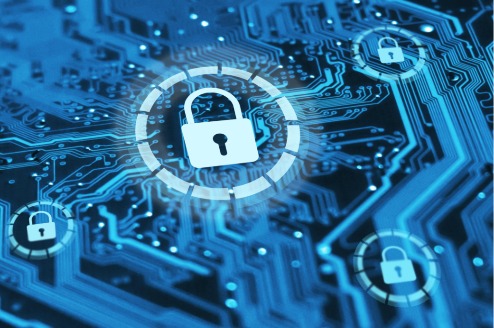

# TechSecMastermind
Exploring the intersection of cybersecurity, software development, and IT expertise. Showcase of projects, certifications, and insights in the world of technology and security.

 <!-- Include an image that represents your project -->

## Table of Contents
- [Overview](#overview)
- [Project Showcase](#project-showcase)
- [Code Samples](#code-samples)
- [Technical Blog Posts](#technical-blog-posts)
- [Certifications and Badges](#certifications-and-badges)
- [Contributions and Collaborations](#contributions-and-collaborations)
- [Tech Stack and Tools](#tech-stack-and-tools)
- [Problem-Solving and Algorithm Challenges](#problem-solving-and-algorithm-challenges)
- [Documentation and Guides](#documentation-and-guides)
- [Open to Collaboration](#open-to-collaboration)

## Overview
Welcome to my GitHub repository! This space showcases my expertise and contributions in the field of Information Technology, with a focus on cybersecurity, software development, and various IT-related domains. Here, you'll find a collection of my projects, certifications, blog posts, and more.

## Project Showcase
### Project 1: Cybersecurity Framework Development
- [Project Details](link-to-project-1)
- [Technologies Used](link-to-technologies)

### Project 2: Secure Software Development - Thonic Insurance Software (THIS)
- [Project Details](link-to-project-2)
- [Technologies Used](link-to-technologies)

### Project 3: Incident Management and Response System
- [Project Details](link-to-project-3)
- [Technologies Used](link-to-technologies)

## Code Samples
- [Code Sample 1](link-to-code-sample-1)
- [Code Sample 2](link-to-code-sample-2)

## Technical Blog Posts
- [Blog Post 1](link-to-blog-post-1)
- [Blog Post 2](link-to-blog-post-2)

## Certifications and Badges
- [Certification 1](link-to-certification-1)
- [Certification 2](link-to-certification-2)

## Contributions and Collaborations
- [Open Source Project 1](link-to-project-1)
- [Open Source Project 2](link-to-project-2)

## Tech Stack and Tools
- Cybersecurity
- Information Security
- Software Development
- Penetration Testing
- [Full List of Skills and Tools](link-to-skills)

## Problem-Solving and Algorithm Challenges
- [LeetCode Challenges](link-to-leetcode)
- [HackerRank Challenges](link-to-hackerrank)

## Documentation and Guides
- [Guide 1](link-to-guide-1)
- [Guide 2](link-to-guide-2)

## Open to Collaboration
I am open to collaborating on interesting projects and contributing to the tech community. Feel free to connect with me and explore potential collaborations.

## Contact Information
- LinkedIn: [Your LinkedIn Profile](link-to-linkedin)
- Email: [Your Email Address](mailto:your-email@example.com)

[Optional: Include any additional sections or information that is relevant to your work and goals.]

# Project 1: Cybersecurity Framework Development
## Description:

## Role: Project Lead and Cybersecurity Expert
## Technologies: Threat modeling, risk assessment, security architecture, intrusion detection, penetration testing, and firewall implementation.
## Outcome: Successfully fortified network security and mitigated potential vulnerabilities, resulting in a significant reduction in security incidents.
## Project Overview:
In this pivotal project, I assumed the role of Project Lead and Cybersecurity Expert to spearhead the development of a comprehensive cybersecurity framework. The primary objective was to establish robust security measures to safeguard critical systems and data against evolving threats.

## Key Contributions:

## Threat Modeling: Led the team in conducting thorough threat modeling exercises to identify potential security threats and vulnerabilities specific to our organization's infrastructure.

## Risk Assessment: Conducted in-depth risk assessments to evaluate the impact and likelihood of various security risks. This process helped prioritize security efforts effectively.

## Security Architecture: Played a key role in designing and implementing a security architecture that aligned with the organization's business objectives while ensuring the highest levels of data protection.

## Intrusion Detection: Orchestrated the setup of intrusion detection systems to enable real-time threat detection and mitigation, enhancing our incident response capabilities.

## Penetration Testing: Conducted comprehensive penetration testing to proactively identify and address vulnerabilities before they could be exploited by malicious actors.

## Firewall Implementation: Implemented robust firewall solutions to create a secure network perimeter, preventing unauthorized access and protecting sensitive data.

## Project Outcome:
Through the concerted efforts of the team and the strategic implementation of the cybersecurity framework, we achieved remarkable results:

A significant reduction in security incidents, showcasing the effectiveness of our security measures.
Enhanced data protection and minimized the potential impact of security breaches.
Improved incident response capabilities, ensuring swift and efficient resolution of security incidents.
This project underscores my expertise in cybersecurity, particularly in developing comprehensive frameworks to protect organizations against a dynamic threat landscape. It demonstrates my ability to lead complex security initiatives and drive tangible improvements in network security and data protection.

